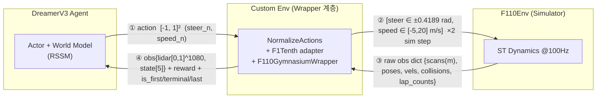

# 002 — Wrapper 양방향 데이터 흐름 (발표 핵심 슬라이드용)

> 목적: 발표 핵심인 "DreamerV3 ↔ F1TENTH 환경 사이를 wrapper가 어떻게 통역하는가"를
> 정확한 형식까지 그림+표로 정리. PPT에 그대로 사용.
> 코드 근거: `dreamer_f1tenth/envs/f1tenth_env.py`, `vendor/dreamerv3-torch/envs/f1tenth.py`
> 관련: understand/001(centerline·reward), 과제 PDF p.28 "Custom env" 다이어그램

---

## 0. 먼저 — "wrapper"는 실제로 여러 겹

개념상 "wrapper" 한 단어로 부르지만, 실제 체인은:

```
DreamerV3 ── NormalizeActions ── F1Tenth adapter ── F110GymnasiumWrapper ── F110Env
```

발표에선 이 셋(NormalizeActions + F1Tenth adapter + F110GymnasiumWrapper)을 묶어
**"Custom Env" 한 박스**로 보여주되, 내부 변환 단계를 표기.

- `F110GymnasiumWrapper`: MDP 본체(obs/action/reward/종료 정의). gymnasium 5-tuple.
- `F1Tenth adapter`: gymnasium 5-tuple → dreamer 내부용 4-tuple 변환, pickling(병렬 envs) 처리.
- `NormalizeActions`: action [-1,1] ↔ raw 물리범위 환산.

---

## 1. 전체 루프 다이어그램 (Mermaid)



**핵심: ③(F110→wrapper)이 ④(wrapper→Dreamer)보다 정보가 많다.**
wrapper가 위치(pose)를 받아 *reward로 흡수*하고, Dreamer엔 위치를 안 넘긴다(표 B).

---

## 2. 표 A — Action 경로 (Dreamer → F110)

| 단계 | 주체 | 데이터 | 형식 / 범위 |
|---|---|---|---|
| ① | Dreamer actor 출력 | `[steer_n, speed_n]` | shape (2,), **정규화 [-1, 1]²** (Normal dist, absmax=1.0) |
| ② | `NormalizeActions` 역정규화 | `[steer, speed]` | [-1,1] → **raw**: steer∈[-0.4189,+0.4189] rad, speed∈[-5,20] m/s |
| ③ | `F110GymnasiumWrapper.step` | `action_2d=[[steer,speed]]` | shape **(1,2) float64**, 물리범위 clip 후 |
| ④ | `F110Env.step` (×2) | 같은 `[[steer,speed]]` | steer=조향각(rad), speed=목표속도(m/s). **action_repeat=2** → 100Hz sim 2틱(0.02s) |

> Dreamer는 무차원 [-1,1]로 말하고, F110은 물리단위(rad, m/s)로 받음. wrapper가 환산 + 2회 반복.

---

## 3. 표 B — Observation 경로 (F110 → Dreamer)

### ③ F110Env → wrapper: raw obs dict (전부 `(1,)` 또는 `(1,1080)`, ego_idx=0)

| raw 키 | 의미 / 단위 | wrapper가 하는 일 |
|---|---|---|
| `scans` | LiDAR 1080빔, **미터(0~30m)** | `clip(0,30)/30` → **lidar** (Dreamer로) |
| `linear_vels_x` | 종방향 속도 m/s | `/20` → state[0] |
| `linear_vels_y` | 횡방향 속도 m/s (#27 패치값) | `/5` → state[1] |
| `ang_vels_z` | yaw rate rad/s | `/2π` → state[2] |
| `poses_x`, `poses_y` | 절대 위치 m | **reward 계산에만** (centerline 투영). Dreamer엔 **안 넘김** |
| `poses_theta` | yaw rad | vel_world 계산(역주행). Dreamer엔 **안 넘김** |
| `collisions` | 충돌 플래그 0/1 | 종료 판정 → reward 페널티. Dreamer엔 flag로만 |
| `lap_counts` | f110 랩수 | **디버그용만** (판정엔 arclength로 대체) |

### ④ wrapper → Dreamer: obs dict (gymnasium 5-tuple 중 obs)

| Dreamer 입력 키 | 형식 | 용도 |
|---|---|---|
| `lidar` | **(1080,) float32 ∈ [0,1]** | → **1D Conv 인코더** |
| `state` | **(5,) float32**: `[vel_x/20, vel_y/5, ang_z/2π, prev_steer/0.4189, prev_speed/20]` | → **MLP 인코더** |
| `is_first` | bool | 에피소드 시작 → **RSSM 잠재상태 리셋** |
| `is_terminal` | bool | 실패 종료(충돌/역주행/발산) → **value bootstrap=0** |
| `is_last` | bool | 에피소드 마지막 스텝(완주/타임아웃) → 에피소드 경계 |
| `log_*` (8개) | float32 | **인코더에서 strip**(tools.py:167) → npz/TB 진단 로깅만 |

> `prev_steer/prev_speed`를 state에 포함 → Dreamer가 직전 행동의 결과를 인지.

---

## 4. 표 C — obs 외에 ④ 방향으로 같이 넘기는 것

| 반환값 | 형식 | 계산 주체 / 내용 |
|---|---|---|
| `reward` | float | **wrapper가 직접 계산**: `progress(clip Δs,0,0.5) + R_lap + (−10 페널티)`. base env reward(0) 버림 |
| `terminated` | bool | 실패/완주 종료(충돌·역주행·발산·2바퀴) |
| `truncated` | bool | 타임아웃(9000스텝=180s) |
| `info` | dict | `cause`, reward 성분 분리, `lap_count_arc`, `arclen_s` 등 (학습 미사용, 분석용) |

*(F1Tenth 어댑터가 마지막에 5-tuple → 4-tuple: `done = terminated or truncated`. obs 그대로.)*

---

## 5. 발표 강조 3가지 인사이트

1. **단위 통역**: Dreamer=무차원 정규화([-1,1] action, [0,1] obs), F110=물리단위(rad·m/s·m).
   wrapper가 양방향 환산 (NN 학습 안정 + 시뮬레이터 호환).
2. **위치의 흡수**: wrapper는 F110에서 절대 위치(pose)를 받지만 Dreamer엔 안 넘기고
   **reward(centerline 진행도)로 변환** → Dreamer는 LiDAR+자기속도만 보는 **위치 비의존 정책**.
3. **reward·종료는 wrapper 소유**: 시뮬레이터의 reward/done을 안 쓰고 wrapper가 MDP의 R과
   종료조건을 정의 → 이게 "환경 설계"의 실체 (PDF의 Custom Reward/Observation/Terminal 박스).
