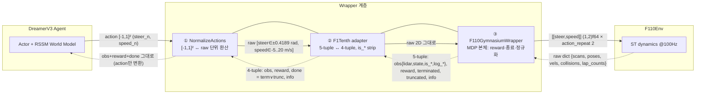

# 004 — Gym/Gymnasium API 용어집 + 정제된 wrapper 데이터흐름 (발표 PPT 문구 대비)

> 목적: 발표 슬라이드에 등장하는 용어(obs/reward/**done**/info/**terminated**/**truncated**/
> **is_first·is_terminal·is_last**/5-tuple·4-tuple 등)를 발표자가 즉답할 수 있도록 코드 근거로 정의.
> 추가로 002의 wrapper 도표를 "Dreamer / Wrapper 3겹 / F110Env" 3박스로 정제한 버전 포함.
> 코드 근거: `dreamer_f1tenth/envs/f1tenth_env.py`, `vendor/dreamerv3-torch/envs/f1tenth.py`,
> `vendor/dreamerv3-torch/envs/wrappers.py`, `vendor/dreamerv3-torch/dreamer.py`.
> 관련: understand/002(데이터흐름 상세·다겹 체인), 003(reverse), 001(reward).

---

## 0. 큰 그림 — 이 용어들은 "Gym API의 약속"이다

RL 환경은 표준 인터페이스(원래 OpenAI **Gym**, 후속 **Gymnasium**)를 따른다. 핵심 두 메서드:
- `obs, info = env.reset()` — 에피소드 시작
- `obs, reward, terminated, truncated, info = env.step(action)` — 한 스텝 진행

→ `step()`의 반환값들이 도표 용어 대부분이다.

> ★ 흔한 착각: **reward는 obs 안에 들어가지 않는다.** obs와 reward는 step 5-tuple의 **별개 원소**.
> (손그림에 `obs(lidar,state+reward+is_*)`로 묶여 있던 것은 분리해서 그릴 것.)

---

## 1. 정제된 wrapper 데이터흐름 (3박스: Dreamer / Wrapper 3겹 / F110Env)

UUID·SelectAction은 순수 배관이라 생략. timeout(truncated) 소유자(TimeLimit)만 각주로 표시.



### Wrapper 3겹 역할 분담

| # | 계층 | Action 방향 (→) | Obs 방향 (←) |
|---|---|---|---|
| ① | **NormalizeActions** | [-1,1]² → raw `(a+1)/2·(hi−lo)+lo` | 그대로 통과(obs 무관) |
| ② | **F1Tenth adapter** | raw 그대로 전달 | **5→4 tuple**, `done=term∨trunc`, is_* 런타임 유지 |
| ③ | **F110GymnasiumWrapper** | clip→(1,2)f64, **×2 sim step** | raw dict → lidar/state 정규화 + **reward·종료 계산** |

> 각주: `terminated`(실패/완주)는 ③ 소유, `truncated`(180s=9000 env-step)는 도표 밖 `TimeLimit` 소유 →
> ②가 `done`으로 OR 합성. (전체 7겹 체인·증거는 understand/002 참조)

---

## 2. `step()` 반환값 — 5-tuple vs 4-tuple

"5-tuple ↔ 4-tuple"은 **gym 버전 차이**다:

| | 형식 | 종료 표현 | 쓰는 곳 |
|---|---|---|---|
| **Gymnasium**(신, 5-tuple) | `(obs, reward, terminated, truncated, info)` | **2개로 분리** | 우리 `F110GymnasiumWrapper` |
| **구 Gym**(4-tuple) | `(obs, reward, done, info)` | **1개(`done`)** | dreamerv3 내부 |

→ adapter가 `done = terminated or truncated`로 합쳐 변환 (`f1tenth.py:104-110`).

| 용어 | 뜻 | 우리 환경 |
|---|---|---|
| **obs** | 에이전트가 보는 관측(**dict**) | `{lidar(1080), state(5), is_first, is_terminal, is_last, log_*}` |
| **reward** | 이 스텝 보상(스칼라) | `progress(Δs) + R_lap − 10·페널티` (`f1tenth_env.py:430`) |
| **terminated** | 규칙상 끝(실패 죽음+정상 완주) | collision/reverse/diverged/lap_complete (`:398-424`) |
| **truncated** | 규칙 무관, 시간 잘림(timeout) | 9000 env-step(180s) (`:426`) |
| **info** | 학습 미사용 **부가 진단 dict** | `cause`, reward 성분, `lap_count_arc` (`:451-468`) |

### done (구 gym 단일 종료신호)
```
done = terminated or truncated   # "죽었든 시간초과든 어쨌든 끝"
```
- adapter가 5-tuple을 4-tuple로 합칠 때 생성(`f1tenth.py:108-109`).
- 약점: "왜 끝났는지"(죽음 vs 시간초과)가 사라짐 → dreamerv3는 obs의 **is_terminal**로 그 구별을 복원.

### terminated vs truncated를 왜 나눴나 (발표 포인트)
- **terminated**(진짜 죽음): 이후 미래가치 = 0.
- **truncated**(시간 잘림): 게임은 계속됐을 것 → 미래가치 **bootstrap(추정 이어붙임)**.
- 한 `done`으로 뭉치면 "시간초과"와 "벽 충돌"을 구별 못 해 학습 왜곡. Gymnasium이 쪼갠 이유.

---

## 3. obs dict 내부 — 특히 `is_*` 3형제 (DreamerV3 고유, gym 표준 아님)

obs dict에 bool로 실림(`f1tenth_env.py:244-250`). 각각 **월드모델 동작 스위치**:

| 키 | True 시점 | Dreamer 동작 |
|---|---|---|
| **is_first** | 에피소드 첫 transition(reset 직후) | **RSSM 잠재상태 리셋**(이전 기억 끊기) |
| **is_terminal** | **실패** 종료(collision/reverse/diverged) | **value bootstrap = 0**(죽음) |
| **is_last** | 에피소드 마지막 transition(완주·timeout 포함) | 에피소드 **경계** 표시 |

### ★ terminated ≠ is_terminal
- **lap_complete(2바퀴 완주)**: `terminated=True`지만 **`is_terminal=False`, `is_last=True`** (`:422-424`).
- "끝났다(terminated)" ≠ "죽었다(is_terminal)". 완주는 성공적 끝 → 죽음 아님(경계만).

| 종료 종류 | terminated | truncated | is_terminal | is_last |
|---|---|---|---|---|
| 충돌/역주행/발산 | ✓ | | **✓** | (실패) |
| 2바퀴 완주 | ✓ | | ✗ | **✓** |
| timeout | | ✓ | ✗ | (경계) |

### obs 나머지 키
| 키 | 뜻 |
|---|---|
| **lidar** | 1080빔 `clip(0,30)/30`→[0,1]. **1D Conv 인코더** |
| **state** | 5D `[vel_x/20, vel_y/5, ang_z/2π, prev_steer, prev_speed]`. **MLP 인코더** |
| **log_*** | 진단 로깅 8개. 인코더 strip→**학습 무영향**, npz/TB 기록만 (`:209-218`) |

---

## 4. Action 쪽 용어

| 용어 | 뜻 |
|---|---|
| **action** | 매 스텝 명령. 연속 **2D** `[steer, speed]` |
| **steer** | 조향각 rad, ±0.4189 |
| **speed** | 목표속도 m/s, −5~20 |
| **[-1,1]²** | 2차원·각 성분 -1~1 = Dreamer 출력 **정규화 무차원 action**(²=차원수) |
| **raw** | 정규화 안 된 **물리단위 실제값**(rad, m/s) |
| **steer_n / speed_n** | normalized steer/speed = [-1,1] 버전 |

---

## 5. F110Env raw obs dict (시뮬레이터 날것, 가공 전)

| raw 키 | 뜻 | 단위 / 처리 |
|---|---|---|
| **scans** | LiDAR 1080빔 거리 | m(0~30) → lidar 정규화 |
| **poses** | 절대 위치/방향 `poses_x/y/theta` | m,m,rad → **reward 계산에만**, Dreamer엔 안 줌 |
| **vels** | `linear_vels_x/y, ang_vels_z` | m/s, rad/s → state |
| **collisions** | 충돌 플래그 | 0/1 → 종료 판정 |
| **lap_counts** | 시뮬 자체 랩수 | 미사용(centerline arclength로 자체 판정) |

---

## 6. 구조 용어 (박스 이름)

| 용어 | 뜻 |
|---|---|
| **MDP** | Markov Decision Process. (상태,행동,보상,전이,종료) 수학 틀. "환경 정의"=MDP 정의 |
| **wrapper** | 환경을 한 겹 감싸 입출력 변형(양파). |
| **adapter** | wrapper 중 **규약(API) 불일치 변환** 전담(여기선 5↔4 tuple) |
| **RSSM** | Recurrent State-Space Model. Dreamer 월드모델 심장, 관측을 잠재로 압축해 미래 상상. `is_first`가 리셋 |
| **World Model** | 환경 동역학을 흉내 학습 → Dreamer가 "모델기반 RL"인 이유 |
| **action_repeat** | 한 action을 시뮬에 몇 번 반복(우리=2, 100Hz sim→50Hz 결정) |
